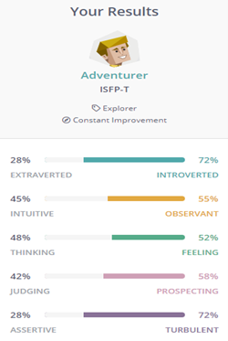
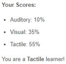
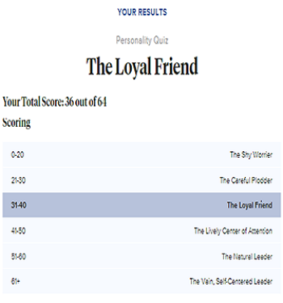

<!DOCTYPE html>
<html>
<head>
</head>
<body>
<h1>Zachary scott</h1>

Student #: s3910896

Email: <a href="mailto:s3910896@student.rmit.edu.au">s3910896@student.rmit.edu.au</a>

<h1>Personal Information</h1>

My name is Zachary (Zac) Scott; I am 21 years old. My birthday is in June; I live in Brisbane and work as a Hire Controller. Some of my interests are app design, computer gaming, fishing, Cooking and Sports, to name a few. I am part Greek, so I love to cook and eat lots of food with my family.

<h1>Interest in IT</h1>

I have always had an interest in IT as it is fun but also mentally challenging. I am interested in learning more amount of server networking as I have watched a couple of my friends' progress through that field. I hope that doing a bachelor's in information technology helps me find a new career in something I am more passionate about and that I can formalise and improve on my skills to find a job suits my interest better. I chose RMIT to do my studies due to the flexibility of being entirely online as a work full-time.

<h1>Ideal Job</h1>
<h2>Network and Systems Administrator</h2>
<h3>Description</h3>

System network administrators are responsible for overseeing and supporting the day-to-day operation of computer systems and networks across an organisation, ensuring reliable performance and data integrity in local area networks, wide area networks, and intranets. System network managers assess a company's needs when setting up and managing computer networks and tracking network performance.

The system network administrator's responsibilities are primarily server-side maintenance and deployment tasks. However, they can also include direct user support, especially during upgrades and migrations. The system network administrator must balance technical skills with a broad understanding of how their data infrastructure is used.

<h3>Skills I have</h3>
<table width="733">
<tbody>
<tr>
<td width="244">

&middot; <strong>Accounting</strong>

</td>
<td width="280">

&middot; <strong>Word &amp; Excel Communication skills</strong>

</td>
<td width="209">

&middot; <strong>Organisation</strong>

</td>
</tr>
<tr>
<td width="244">

&middot; <strong>Information Technology Systems</strong>

</td>
<td width="280">

&middot; Time management

</td>
<td width="209">

&middot; Building Effective Relationships

</td>
</tr>
<tr>
<td width="244">

&middot; <strong>Team Player</strong>

</td>
<td width="280">

&middot; Customer Service

</td>
</tr>
</tbody>
</table>
<h3>Skills I Need</h3>
<ul>
<li>Configuration of software and hardware, including servers, networks, and operating systems &ndash; system network administrators should configure software and hardware, including servers, networks, and operating systems.</li>
<li>System network administrators also play a critical role in information security, so they must be well-versed in best practices and procedures to ensure that company data is protected from unauthorised access or corruption.</li>
<li>Database design &ndash; System network administrators should have experience designing and working with databases because they support infrastructure and data management activities.</li>
<li>Problem-solving abilities &ndash; system network administrators must be able to troubleshoot networks, computers, and devices, so they must be creative and technical problem-solvers.</li>
<li>Strong written and verbal communication skills &ndash; system network administrators must communicate effectively with both users and IT specialists.</li>
</ul>
<h3>Learning Plan</h3>

The first step forward for me was to enrol in a Bachelor of Information Technology to get the formal training required to progress in the industry. After completing my courses, I will start looking for an entry-level position and moving up from there.

<h1>Personality Profile</h1>
<h3>Online Test Results</h3>
<table width="799">
<tbody>
<tr>
<td width="266">

<strong>1. </strong><strong>Myers Briggs Type Indicator</strong>

</td>
<td width="189">

<strong>2. </strong><strong>Learning style test</strong>

</td>
<td width="344">

<strong>3. </strong><strong>Dr Phil's Personality Test (PsychCentral)</strong>

</td>
</tr>
<tr>
<td width="266">

(Workplace Habits | Adventurer (ISFP) Personality | 16Personalities, 2021)

</td>
<td width="189">

(What's Your Learning Style? 20 Questions, 2021)

</td>
<td width="344">

(Dr. Phil&rsquo;s Personality Test, 2021)

</td>
</tr>
</tbody>
</table>
<h2>Myers Briggs Type Indicator</h2>

Adventurer personalities are true artists, but not in the traditional sense. They are not always out painting happy little trees. They are, however, frequently capable of doing so. Instead, they use aesthetics, design, and even their own choices and actions to challenge social norms. The phrase "Do not box me in!" has probably been uttered more than once by adventurers who enjoy upsetting traditional expectations with experiments in beauty and behaviour.

<h3>Strengths</h3>
<table width="787">
<tbody>
<tr>
<td width="273">

&middot; <strong>Charming</strong>

</td>
<td width="196">

&middot; <strong>Curious</strong>

</td>
<td width="317">

&middot; <strong>Sensitive to Others</strong>

</td>
</tr>
<tr>
<td width="273">

&middot; <strong>Passionate</strong>

</td>
<td width="196">

&middot; Artistic

</td>
<td width="317">

&middot; Imaginative

</td>
</tr>
</tbody>
</table>
<h3>Weaknesses</h3>
<table width="763">
<tbody>
<tr>
<td width="240">
<ul>
<li>Easily Stressed</li>
</ul>
</td>
<td width="226">
<ul>
<li>Unpredictable</li>
</ul>
</td>
<td width="296">
<ul>
<li>Fiercely Independent</li>
</ul>
</td>
</tr>
<tr>
<td width="240">
<ul>
<li>Overly Competitive</li>
</ul>
</td>
<td width="226">
<ul>
<li>Fluctuating Self-Esteem</li>
</ul>
</td>
</tr>
</tbody>
</table>
<h3>Team Composition</h3>

Adventurers are the most at ease among their peers. Working with others on a level playing field and offering advice to solve practical problems is exactly where Adventurer personalities thrive. While they may become exhausted if their task needs a lot of social interaction, they are otherwise charming and have excellent networking skills. Usually, adventurers do what needs to be done, regardless of whether their teammates are pulling their weight. However, adventurers are sensitive people who need to know that their efforts are valued. Adventurers seek harmony and, whenever possible, seek out win-win solutions. When forming a team, it is important to choose the right people to do it with; that way, personalities do not clash. A leader will be needed when for said groups as an adventurer is a follower that silently helps.

<h2>Test Two</h2>
<h3>What's Your Learning Style</h3>

I am a tactile learner who enjoys taking things apart and putting them back together, and when I am bored, I like to tinker or move around. I have good athletic abilities and am well-coordinated. I can easily recall what was done, but I may have trouble remembering what I saw or heard during the process. Touch is a common way for me to communicate. I appreciate physical expressions of encouragement like a pat on the back. I learn by touching and doing because I am a tactile learner. Physical movement helps me understand and remember things. I am a "hands-on" learner who prefers to touch, move, build, or draw what I am learning, and I learn best when I am doing something physical. I need to be active and take frequent breaks; I frequently use my hands and gestures to communicate and find it challenging to sit still.

<h2>Test Three</h2>
<h3>Dr Phil's Personality Test (PsychCentral)</h3>

People see me as practical, cautious, and cautious. They think of me as intelligent, gifted, or gifted but modest. I am not someone who makes friends easily or quickly, but I am incredibly loyal to the friends I do have, and I expect the same loyalty in return. Those who get to know me well realise that it takes a lot to shake my faith in my friends, but it also takes a long time to recover it if that trust is ever broken.

<h1>Project Idea</h1>
<h3>Overview</h3>

The project that I would like to make will be a phone app. It will be an app that allows the user to calculate transport costs, check spreadsheets on machinery and have the contact information to speak to a representative. This app would be used for customers to find the equipment they require; they then can look at the costing of that unit and calculate the transport pricing.

<h3>Motivation</h3>

Lorem ipsum dolor sit amet, consectetur adipiscing elit. Donec ultricies massa et erat luctus hendrerit. Curabitur non consequat enim.

<h3>Description</h3>

Lorem ipsum dolor sit amet, consectetur adipiscing elit. Integer dolor metus, interdum at scelerisque in, porta at lacus. Maecenas dapibus luctus cursus. Lorem ipsum dolor sit amet, consectetur adipiscing elit. Donec ultricies massa et erat luctus hendrerit. Curabitur non consequat enim. Vestibulum bibendum mattis dignissim. Proin id sapien quis libero interdum porttitor.

<h3>Tools and Technologies</h3>

Lorem ipsum dolor sit amet, consectetur adipiscing elit. Donec ultricies massa et erat luctus hendrerit. Curabitur non consequat enim. Vestibulum bibendum mattis dignissim. Proin id sapien quis libero interdum porttitor.

<h3>Skills Required</h3>

Lorem ipsum dolor sit amet, consectetur adipiscing elit. Donec ultricies massa et erat luctus hendrerit. Curabitur non consequat enim.

<h3>Outcome</h3>

Lorem ipsum dolor sit amet, consectetur adipiscing elit. Donec ultricies massa et erat luctus hendrerit. Curabitur non consequat enim.

<h1>Bibliography</h1>

16Personalities. 2021.&nbsp;Workplace Habits | Adventurer (ISFP) Personality | 16Personalities. [online] Available at: &lt;<a href="https://www.16personalities.com/isfps-at-work">https://www.16personalities.com/isfps-at-work</a>&gt; [Accessed 27 March 2021].

Educationplanner.org. 2021.&nbsp;What's Your Learning Style? 20 Questions. [online] Available at: &lt;<a href="http://www.educationplanner.org/students/self-assessments/learning-styles-quiz.shtml?event=results&amp;A=2&amp;V=7&amp;T=11">http://www.educationplanner.org/students/self-assessments/learning-styles-quiz.shtml?event=results&amp;A=2&amp;V=7&amp;T=11</a>&gt; [Accessed 27 March 2021].

Psych Central. 2021.&nbsp;Dr Phil's Personality Test. [online] Available at: &lt;<a href="https://psychcentral.com/quizzes/personality-quiz%235">https://psychcentral.com/quizzes/personality-quiz#5</a>&gt; [Accessed 27 March 2021].

Christmas is around the corner and the best gift for any occasion is a Rubik's Cube which can be easily solved with <a href="https://www.youtube.com/watch?v=VeeFwwAz7nohow-to-solve-a-rubiks-cube/" rel="nofollow noopener">this easy tutorial</a>.

</body>
</html>

</body>
</html>
